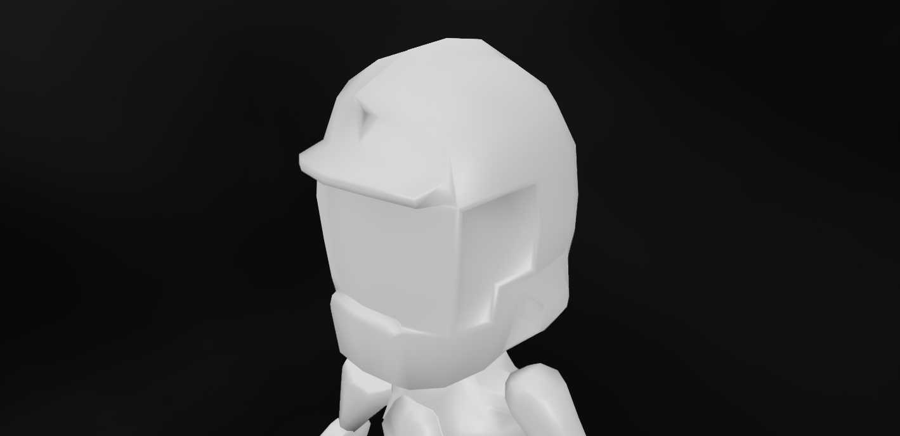
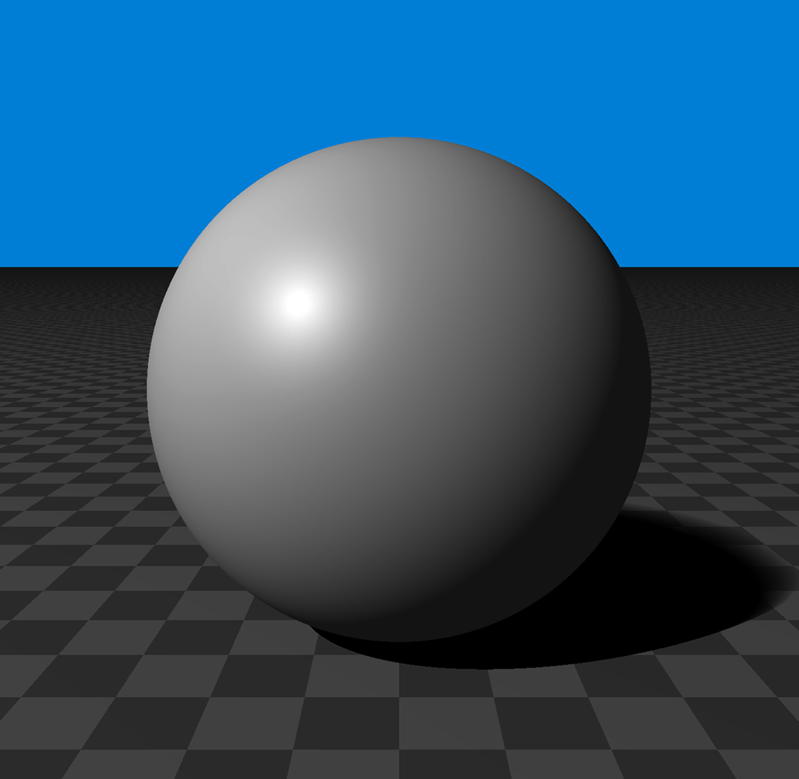

{: .home-logo .d-flex .flex-justify-around}
# Técnicas de Gráficos por Computadora
{: .home-title .d-flex .flex-justify-around	 }

## ¡Hola!
{: .d-flex .flex-justify-around}

Este es el sitio oficial de Técnicas de Gráficos por Computadora,
la materia de tercer año de la Universidad Tecnológica Nacional, Facultad Regional Buenos Aires.
Acá vas a poder encontrar todos los recursos que necesites para la cursada.

{: .d-flex .flex-justify-around .home-image}
### Gráficos por Computadora
{: .home-title .d-flex .flex-justify-around	 }
Llamamos Gráficos por Computadora al campo de las ciencias de la computación que se dedica a la generacion de imagenes digitales.
En esta asignatura nos focalizaremos en Aplicaciones Gráficas en Tiempo Real[^rti], muy utilizadas en el mundo de la arquitectura, videojuegos, medicina, y más.

Quiere decir que nos alejamos de los sistemas orientados a eventos, comunes en otras materias, y nos adentramos en los sistemas en tiempo real:
¡Nuestro código responde muchas veces por segundo!

El objetivo es formar personas en los fundamentos de esta área y otorgar los conocimientos necesarios para poder crear este tipo de aplicaciones, que puedan aprender los desarrollos mas recientes sin dificultad. 

### ¿Cuales son las condiciones de aprobación?
{: .home-title .d-flex .flex-justify-around	 }
para aprobar la asignatura es necesario realizar un [trabajo teórico práctico integrador]() en el cual se implementan todos los conocimientos adquiridos durante la cursada y un parcial teórico práctico.

{: .d-flex .flex-justify-around .home-image}
### ¿Cómo se desarrolla la materia?
{: .home-title .d-flex .flex-justify-around	 }

Durante la cursada, se exploran los contenidos teóricos que conllevan dibujar modelos tridimensionales en tiempo real.

Cómo se compone un modelo, puntos en el espacio, transformaciones para llevarlo a la pantalla, y técnicas para iluminarlo junto con distintos efectos que se pueden lograr.

{: .d-flex .flex-justify-around .home-image}
### ¿Esto significa que voy a tener que hacer modelos 3D?
{: .home-title .d-flex .flex-justify-around	 }
**¡No!**
la asignatura está orientada no a los recursos en una aplicación gráfica (modelos, texturas, sonidos) sino estrictamente a la programación, no evaluamos diseño grafico. 

Te vamos a dar los modelos necesarios para tu TP. Si aun queres usar un modelo propio, podes, pero tene en cuenta que el tiempo que dediques a hacer andar un modelo es tiempo que no dedicas a la parte que se evalua!

### ¿Que tengo que saber de matematica para poder cursar?
{: .home-title .d-flex .flex-justify-around	 }

Tanto la teoría como la práctica requieren de conocimientos en matemática, vistos en las materias homogeneas de la carrera.
 * Calculo vectorial
 * Algebra de matrices
 * Coordenadas Cartesianas, Polares, y como ir de una a otra
 * Geometria del espacio (Puntos, Rectas y Planos)

Como trabajamos con modelos, puntos y espacios, también es importante que desempolves tus apuntes de geometría. No vamos a derivar ni integrar.

¿Necesitás un repaso? Te cubrimos, [Matematica para graficos]().

## Google Group de la catedra
{: .home-title .d-flex .flex-justify-around	 }

    [Unirse ](https://groups.google.com/g/TecnicasDeGraficosPorComputadora/about){: .btn .btn-blue}

## Contacto
{: .home-title .d-flex .flex-justify-around	 }

[ Telegram](https://t.me/joinchat/DSaH6kbltQS0jdkF3e5IqA){: .btn .btn-blue}
[ Email](mailto:tgcentregas@gmail.com){: .btn .btn-blue}

[^rti]: Aquellas aplicaciones que tienen que responder en un intervalo de tiempo determinado, usualmente corto.


